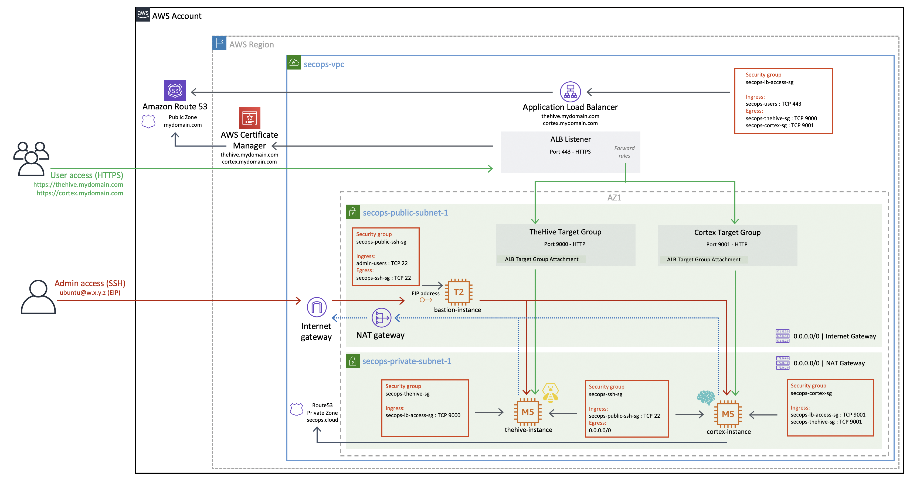

# AWS sample code

**This Terraform 0.12 code is now obsolete - please use the Terraform 1.x code in the [aws](../aws/README.md) folder which is compatible with both TheHive v4/v5 and Cortex. This code remains available for reference purposes only and will not be maintained anymore.**

## Overview 

The sample Terraform code in this repository allows the creation of a complete SecOps VPC to host your TheHive and Cortex instances and expose them using a load balancer.

The sample code is organised in seven folders:

* [ug-secops-vpc](ug-secops-vpc/) --> to create and manage the SecOps VPC
* [ug-secops-thehive-new](ug-secops-thehive-new/) --> to launch a new TheHive v3 instance with an empty database
* [ug-secops-thehive-migration](ug-secops-thehive-migration/) --> to launch a new TheHive v3 instance with existing data (upgrade / replace scenario)
* [ug-secops-thehive4-new](ug-secops-thehive4-new/) --> to launch a new TheHive v4 instance with an empty database
* [ug-secops-thehive4-migration](ug-secops-thehive4-migration/) --> to launch a new TheHive v4 instance with existing data (upgrade / replace scenario)
* [ug-secops-cortex-new](ug-secops-cortex-new/) --> to launch a new Cortex instance with an empty database
* [ug-secops-cortex-migration](ug-secops-cortex-migration/) --> to launch a new Cortex instance with existing data (upgrade / replace scenario)

This code organisation allows the creation of all required VPC resources if you do not already operate a VPC (or if you want to create a new one for your SecOps needs), independently from TheHive and Cortex deployments.

The sample code to launch TheHive and Cortex instances defaults to this new VPC but can easily be adapted to fit your existing VPC by customising a few variables. Unless your architecture significantly differs from our reference VPC, you should not be required to modify the Terraform code itself.
