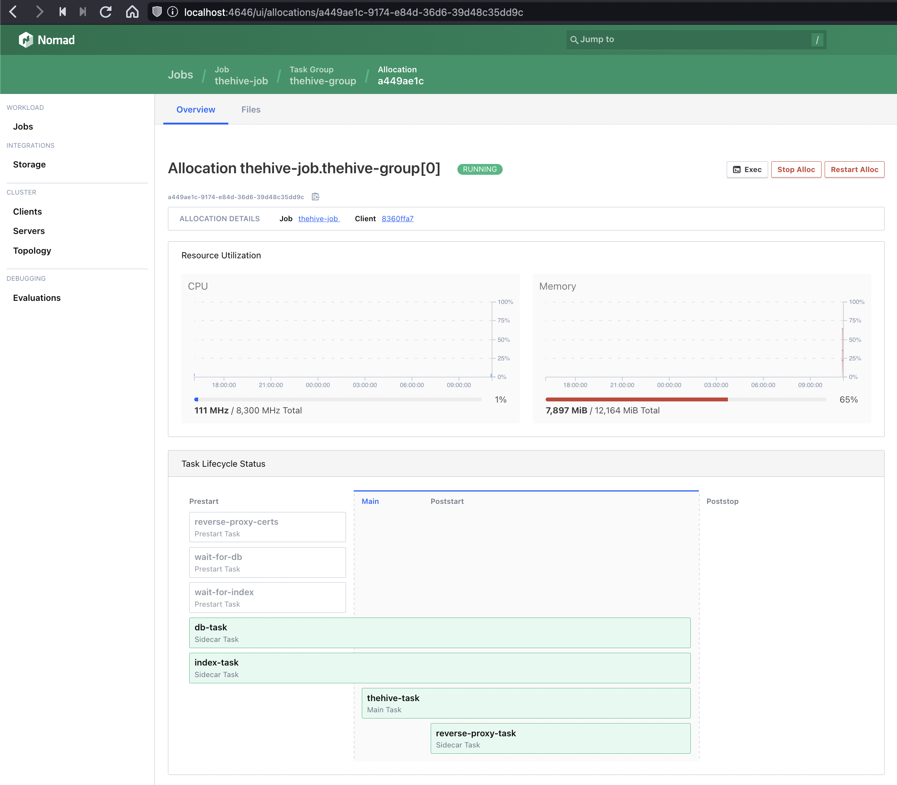

# Deploying TheHive v5 and Cortex with Terraform

This code will work out of the box with the reference *SecOps vnet* created with our sample code. You can nonetheless use it to deploy TheHive and Cortex within your own pre-existing vnet with minimal adjustments (only a few variables to update if your setup is similar to our reference architecture).

Our sample code can handle two use-cases:

+ Deploying brand new **TheHive and Cortex instances** with empty databases - this is useful for an initial deployment.
+ Deploying **TheHive and Cortex instances** while restoring existing databases - this is to be used for all other use-cases: image updates, instance size upgrades or downgrades, database restore, etc.

>The instance initialization script will automatically detect if the persistent disks already contain data and will behave accordingly (initial setup or restore).

## TL;DR;
+ Clone this repository
+ Set / update the required variables
+ `terraform init` && `terraform apply`
+ Once the `terraform apply` is over, wait up to 5 minutes for both instances to be fully operational. You can check the initialisation or restore progress by tailing the `/var/log/cloud-init-output.log` and `/opt/strangebee/ops/logs/ops-launch.sh.log` files on each instance.

## Overview

This is an overview of the resulting TheHive and Cortex instances when deployed with our Terraform sample code in our reference *SecOps vnet*.


## Information on the default data disks configuration
All TheHive and Cortex data is stored on dedicated data disks, not in the OS disks. This approach has many advantages:

+ Your OS disk is disposable, you can replace your instances in seconds to update TheHive or Cortex by launching a fresh image or to migrate to a more (or less) powerful instance.
+ Your data disks can be of any size while keeping the OS disk to its default size. 
+ Increasing (or decreasing) the size of a data disk on an existing instance is a lot easier than changing the OS disk size.
+ You can restore your database from a previous state using disk snapshots.

By default, the sample code expects the four persistent data disks to already exist (two for each instance):
+ TheHive data volume - `lun0` - mounted at `/opt/thp_data` on TheHive instance
+ TheHive Docker volume - `lun1` - mounted at `/var/lib/docker` on TheHive instance
+ Cortex data volume - `lun0` - mounted at `/opt/thp_data` on Cortex instance
+ Cortex Docker volume - `lun1` - mounted at `/var/lib/docker` on Cortex instance

We created these persistent disks along with the vnet, so if you are using a custom or existing vnet, create them first and input their names in the associated variables. This way, the disks will not be deleted when the instances are terminated. This ensures that your data isn't accidentally lost.

>Note that the disks are automatically managed if you use our sample Terraform code, you do not need to partition, format and mount the volumes, everything is taken care of for you!

## Connecting to your instances with SSH
Since our TheHive and Cortex instance are located in a private subnet, we cannot directly SSH into them using their private IP addresses. If you have set up a bastion host configuration similarly to our reference architecture, you can seamlessly connect to private instances using the *proxyjump* functionality of the ssh client. The bastion host will be able to perform the hostname resolution with the private DNS zone we have set up in the VPC.

The easiest way to do that is to create (or update) the `~/.ssh/config` file. Use the example below as a reference and replace the ip addresses and private key information.

The default username for both the bastion host and TheHive instance is `azureuser`.

```
Host bastion
	HostName 1.2.3.4 (public ip)
	User azureuser
	Port 22
	IdentityFile ~/.ssh/id_rsa_private_key_for_bastion

Host thehive
	HostName thehive.secops.cloud
	User azureuser
	Port 22
	ProxyJump bastion
	IdentityFile ~/.ssh/id_rsa_private_key_for_thehive

Host cortex
	HostName cortex.secops.cloud
	User azureuser
	Port 22
	ProxyJump bastion
	IdentityFile ~/.ssh/id_rsa_private_key_for_cortex
```

> *We use the secops.cloud domain as an example but the best security practice is to use a domain name you own even for private DNS resolution in split-horizon.*

You will now be able to SSH into your instances directly using the bastion host as a proxy:

`$ ssh thehive` 

or

`$ ssh cortex`

**Note**: Remember to whitelist your local public IP address in the bastion network security group. 

## Accessing the Nomad UI

It can sometimes be useful to access the Nomad UI to control the running application stack or to easily access the container console logs for each running task.



Since we are running Nomad in a standalone mode, without ACLs being implemented, we do not automatically expose the UI outside the instance itself (in other words, it will not be reachable from the Application Gateway using our sample Terraform code).

If you need occasional Nomad UI access, you can simply set a temporary SSH tunnel to the instance and forward a local port to the UI (which listens locally on port 4646 on each TheHive / Cortex instance).

> Note: if you wish to access the Nomad UI for multiple instances this way, you must use a different local port for each instance. 

The following examples show how to launch these tunnels using an openSSH client in a vnet where the application instances are on a private subnet that can be reached only through a bastion host (jump host).

**Example: access the Nomad UI for your TheHive instance - locally on port 46461**

`$ ssh -L 46461:localhost:4646 azureuser@your_thehive_instance -J azureuser@your_bastion_instance`

The Nomad UI for your TheHive instance can now be opened in your browser at `http://localhost:46461/ui/`

**Example: access the Nomad UI for your Cortex instance - locally on port 46462**

`$ ssh -L 46462:localhost:4646 azureuser@your_cortex_instance -J azureuser@your_bastion_instance`

The Nomad UI for your Cortex instance can now be opened in your browser at `http://localhost:46462/ui/`

The same configuration can be achieved by updating your `SSH config` file to include a `LocalForward` statement for each remote instance:

```
Host bastion
	HostName 1.2.3.4 (public ip)
	User azureuser
	Port 22
	IdentityFile ~/.ssh/id_rsa_private_key_for_bastion

Host thehive
	HostName thehive.secops.cloud
	User azureuser
	Port 22
	ProxyJump bastion
	IdentityFile ~/.ssh/id_rsa_private_key_for_thehive
	LocalForward 46461 localhost:4646

Host cortex
	HostName cortex.secops.cloud
	User azureuser
	Port 22
	ProxyJump bastion
	IdentityFile ~/.ssh/id_rsa_private_key_for_cortex
	LocalForward 46462 localhost:4646
```

> Note: Setting up an SSH tunnel between your computer and the remote instances requires that tunnelling and TCP forwarding be allowed on all hosts involved in the process. When you use the sample Terraform code in this repository, this is possible OOTB.

## Updating TheHive and Cortex over time

Once your instances are deployed, you can easily update TheHive and / or Cortex. In a nutshell, the process consists in replacing the image versions in a variable file and restarting each application stack. This process it detailed at length in [this dedicated documentation page](docs/upgrade.md).

---
Terraform compatibility: v1.x
