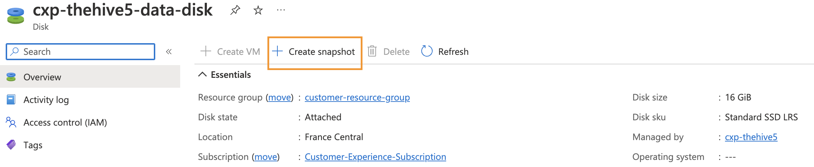

# Upgrading your Azure instances

This documentation page describes how to upgrade the application stack on your instance (TheHive, Cortex and related services such as Cassandra and ElasticSearch).

It does not cover operating system level updates such as Ubuntu patches, Docker updates, Nomad updates, etc. We recommend replacing your instance and using a fresh Azure Marketplace image to update all OS-level components to avoid any software version inconsistency / incompatibility.

**IMPORTANT: To avoid data loss / data corruption, you should ALWAYS backup or snapshot your persistent data volumes before performing any kind of update process.**

---
## TL;DR;

**Note: All actions on the instances are to be performed as root**

- Stop the running Nomad job 
>ex: `$ . /opt/strangebee/ops/scripts/ops-common.cfg && stop_nomad_job thehive-job`
- Backup your Nomad job specifications and var files 
>ex: `$ /opt/strangebee/ops/scripts/ops-config-backup.sh -n nomad-jobs -f /opt/thp_data/nomad/jobs/`
- Backup / snapshot your instance persistent data volume (using the Azure console or CLI)
- Edit the Nomad job var file matching the running job on the instance and update the image versions you wish to use from now on.
>All job specifications and var files are located under `/opt/thp_data/nomad/jobs` ex: `$ vi /opt/thp_data/nomad/jobs/thehive-job.vars`
- Schedule the Nomad job (don't forget to set the matching var file)
>ex: `$ . /opt/strangebee/ops/scripts/ops-common.cfg && run_nomad_job thehive-job`

---
## Context

The Azure Marketplace image for TheHive v5 can be used to deploy both TheHive v5 and / or Cortex v3. The image itself includes a hardened version of the official Ubuntu image from Canonical and a preconfigured Hashicorp Nomad engine. The image launch-time configuration you applied determined if TheHive or Cortex or both got installed on a given instance (as Nomad service jobs).

To make things simpler for Azure admins with varying level of Hashicorp Nomad experience (including first-time Nomad users), we provide three different job specifications baked in the image to allow three instance deployment scenarios (instead of a more complex, dynamic one, that can adapt to all use-cases).

The job specifications are named as follow:

- TheHive only --> `thehive-job`
- Cortex only --> `cortex-job`
- TheHive and Cortex on the same instance --> `thehive-cortex-job`

Once your instances are deployed, you can check which profile is applied on a given instance with the following command (to be run on the instance):

`$ nomad status`

If you deployed TheHive only, the output is the following:

```
ID           Type     Priority  Status   Submit Date
thehive-job  service  50        running  ***
```

Likewise, if you deployed Cortex only, the output is:

```
ID          Type     Priority  Status   Submit Date
cortex-job  service  50        running  ***
```

And finally, if you deployed both TheHive and Cortex, the output is predictably:

```
ID                  Type     Priority  Status   Submit Date
thehive-cortex-job  service  50        running  ***
```

## Marketplace image storage vs. persistent instance storage

Before we go any further, a quick note on *image* vs. *persistent storage*.

As mentioned in the [README](../README.md), persistent data gets stored on a dedicated volume, not on the root filesystem. By default, your persistent data volume will be mounted at `/opt/thp_data`.

```
$ lsblk

NAME    MAJ:MIN RM  SIZE RO TYPE MOUNTPOINT
loop0     7:0    0 67.8M  1 loop /snap/lxd/22753
loop1     7:1    0   62M  1 loop /snap/core20/1587
loop2     7:2    0   47M  1 loop /snap/snapd/16292
loop3     7:3    0   48M  1 loop /snap/snapd/17029
loop4     7:4    0 63.2M  1 loop /snap/core20/1623
sda       8:0    0   16G  0 disk
└─sda1    8:1    0   16G  0 part /opt/thp_data
sdb       8:16   0   32G  0 disk
└─sdb1    8:17   0   32G  0 part /var/lib/docker
sdc       8:32   0   30G  0 disk
├─sdc1    8:33   0 29.9G  0 part /
├─sdc14   8:46   0    4M  0 part
└─sdc15   8:47   0  106M  0 part /boot/efi
sr0      11:0    1  638K  0 rom
```
> The Docker volume mounted at `/var/lib/docker` is also persistent but contains no persistent data and does not need to be backed-up. We use a dedicated Docker volume only for size adaptability since Docker images could require a lot of storage space (say if you were to use all available Cortex analyzer / responder images) or not that much if you only run TheHive on the instance.

We provide templates for the Nomad job specifications within the image. The templates are located at: `/opt/strangebee/ops/templates/nomad/jobs`. All files under the `templates` folder are **only meant as templates to be used somewhere else** (most likely on your persistent storage). So, the only time window where it can be useful to modify the templates is at first instance launch, before initialising the instance (and thus before copying them to the persistent storage).

> Every time you replace an instance and use a fresh Azure Marketplace image, the root filesystem gets completely reset based on the new image, including the `templates` folder.

The effective runtime configuration files used to launch Nomad jobs are all located on the persistent storage at: `/opt/thp_data/nomad/jobs`.

> When you replace an instance and use a fresh Azure Marketplace image, the persistent storage remains exactly as you left it when you stopped the previous instance.

To proceed with TheHive / Cortex updates, we will only modify files on the persistent volume, all located under `/opt/thp_data/nomad/jobs`.

## Update step 1/3: stop the apps and perform some backups

### Stop the running Nomad job

Before performing configuration and data backups, we will stop the running Nomad job on each instance (use the appropriate job name on each instance as identified earlier in the Context section). This will stop TheHive and / or Cortex along with all depending services such as Cassandra and ElasticSearch.

>Note: **All actions on the instances during the entire update process are to be performed as root**. Once connected to the instance, you can switch to the root context using the `sudo su` command.

`$ . /opt/strangebee/ops/scripts/ops-common.cfg && stop_nomad_job thehive-job`

```
[INFO] Stopping Nomad job: thehive-job
[INFO] Fetching Nomad ACL management token
```

You can check the job is now stopped:

`$ nomad status`

```
ID           Type     Priority  Status          Submit Date
thehive-job  service  50        dead (stopped)  ***
```

### Backup existing Nomad job specifications and variable files

We will now backup the existing Nomad job specifications and variable files before updating them. A script to do so is baked into the image, use it with the `-n` flag to set the backup name and `-f` flag to set the folder to backup. All backups will get stored on your persistent volume under `/opt/thp_data/backup`.

`$ /opt/strangebee/ops/scripts/ops-config-backup.sh -n nomad-jobs -f /opt/thp_data/nomad/jobs/`

```
[INFO] Initial checks
[INFO] Backup of /opt/thp_data/nomad/jobs/

--- START of nomad-jobs config backup - Mon Oct 10 14:45:48 UTC 2022 ---

tar: Removing leading `/' from member names
/opt/thp_data/nomad/jobs/
/opt/thp_data/nomad/jobs/thehive-job.nomad
/opt/thp_data/nomad/jobs/thehive-db-init-job.nomad
/opt/thp_data/nomad/jobs/thehive-cortex-job.nomad
/opt/thp_data/nomad/jobs/thehive-db-init-job.vars
/opt/thp_data/nomad/jobs/cortex-job.nomad
/opt/thp_data/nomad/jobs/thehive-cortex-job.vars
/opt/thp_data/nomad/jobs/cortex-job.vars
/opt/thp_data/nomad/jobs/thehive-job.vars
[INFO] Purging backups older than 7 days

--- END of nomad-jobs config backup - Mon Oct 10 14:45:48 UTC 2022 ---
```

You can now check the resulting archive.

`$ ll /opt/thp_data/backup`

```
total 16
drwxr-xr-x  2 root root 4096 Oct 10 14:45 ./
drwxr-xr-x 12 root root 4096 Oct 10 10:59 ../
-rw-r-----  1 root root 3261 Oct 10 14:45 nomad-jobs.conf.backup.2022-10-10.tar.gz
-rw-r-----  1 root root 3261 Oct 10 14:45 nomad-jobs.conf.latest.tar.gz
```

> Note: using the configuration backup script, the latest backup gets copied with the `latest` suffix. The latest backups never get deleted when older backups get purged.

### Backup or snapshot your persistent data volume

Using the Azure console or CLI, snapshot your persistent data volume before performing any update:



Snapshot the persistent data volume **for each instance** you are updating.

## Update step 2/3: update the image versions in the Nomad job variable file

To make the update process easier, we have stored the image versions used in the Nomad job specifications in an external variables file. In most cases, it is not necessary to ever update the job specifications file unless you wish to fine tune some technical settings, such as the resources allocated to each task (CPU & RAM).

For example, we will update TheHive along with its dependencies on an instance running the `thehive-job` Nomad job. This job is described in two files:

- The job specifications file located at: `/opt/thp_data/nomad/jobs/thehive-job.nomad`
- The job variables file located at: `/opt/thp_data/nomad/jobs/thehive-job.vars`

To update the image versions, we need to edit the variables file:

`$ vi /opt/thp_data/nomad/jobs/thehive-job.vars`

```
thehivecontext = "/thehive"
image_cassandra = "cassandra:4.0.6"
image_elasticsearch = "elasticsearch:7.17.6"
image_nginx = "nginx:1.23.1"
image_thehive = "strangebee/thehive:5.0.16-1"
```

Our instance was running TheHive v5.0.16 along with Cassandra v4.0.6 and ElasticSearch v7.17.6. 

Let's update the image versions (this is just an example, use the actual versions you wish to deploy):

```
thehivecontext = "/thehive"
image_cassandra = "cassandra:4.1.0"
image_elasticsearch = "elasticsearch:7.17.9"
image_nginx = "nginx:1.24.0"
image_thehive = "strangebee/thehive:5.1.4-1"
```

> We recommend never using the `:latest` tag and always using specific image versions to avoid problems or inconsistencies.

### Image references

You can find the available image versions for each component at the following links:

- [TheHive images](https://hub.docker.com/r/strangebee/thehive/tags)
- [Cortex images](https://hub.docker.com/r/thehiveproject/cortex/tags)
- [Cassandra images](https://hub.docker.com/_/cassandra/tags)
- [ElasticSearch images](https://hub.docker.com/_/elasticsearch/tags)
- [Nginx images](https://hub.docker.com/_/nginx/tags)

> **Important note** TheHive v5 is not yet compatible with ElasticSearch v8.x - only the 7.x versions are supported for the time being.

You can find the changelog for TheHive and Cortex at the following links:
- [TheHive changelog](https://docs.strangebee.com/thehive/release-notes/release-notes-5.1/)
- [Cortex changelog](https://github.com/TheHive-Project/Cortex/releases)

## Update step 3/3: Schedule the Nomad job

You can now schedule the Nomad job to start TheHive and / or Cortex. Do not forget to set the variable file we just modified when running the job, otherwise it will fail.

`$ . /opt/strangebee/ops/scripts/ops-common.cfg && run_nomad_job thehive-job`

```
[INFO] Scheduling Nomad job: thehive-job
[INFO] Fetching Nomad ACL management token
```

To check the job is now running again:

`$ nomad status`

```
ID           Type     Priority  Status   Submit Date
thehive-job  service  50        running  ***
```

To check the updated TheHive version:

`$ . /opt/strangebee/ops/scripts/ops-common.cfg && check_rp $(get_host_ip) thehive`

```
[INFO] Checking local reverse proxy on /thehive/api/status
{"versions":{"Scalligraph":"5.1.4-1","TheHive":"5.1.4-1","Play":"2.8.x"},"config":{"protectDownloadsWith":"malware","authType":["session","local","key"],"capabilities":["changePassword","setPassword","authByKey","mfa"],"ssoAutoLogin":false,"pollingDuration":1000,"freeTagDefaultColour":"#000000"}}
```

To check the updated Cortex version:

`$ . /opt/strangebee/ops/scripts/ops-common.cfg && check_rp $(get_host_ip) cortex`

```
[INFO] Checking local reverse proxy on /cortex/api/status
{"versions":{"Cortex":"3.1.7-1","Elastic4Play":"1.13.6","Play":"2.8.16","Elastic4s":"7.17.2","ElasticSearch client":"7.17.1"},"config":{"protectDownloadsWith":"malware","authType":["key","local"],"capabilities":["authByKey","changePassword","setPassword"],"ssoAutoLogin":false}}
```

