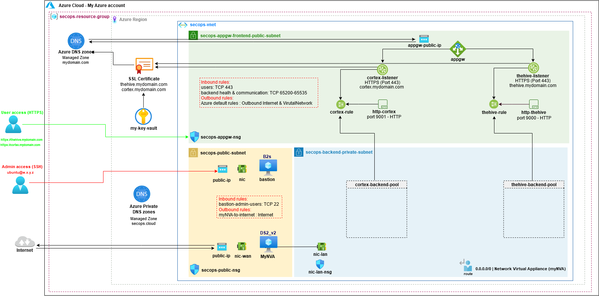

# Creating a new SecOps Virtual Network

If you do not already have a virtual network (vnet) at hand to deploy TheHive and Cortex into, using our sample code will allow you to build a production-ready vnet very easily.

## Overview
The reference architecture vnet consists of the following resources



The vnet will include:
- Two **public subnets** (one for the Application Gateway, the other for the bastion and network virtual appliance hosts)
- One backend **private subnet** to host our TheHive and Cortex instances
- An **Application Gateway** to securely handle the public-facing traffic to our TheHive and Cortex instances
- All required **Network Security Groups**
- **Public DNS records** for TheHive and Cortex to point to the Application Gateway 
- A **bastion host** to SSH into our TheHive and Cortex instance hosted in the private subnet
- A **Network Virtual Appliance** to allow Internet access for our instances in the private subnet through a NAT gateway

## Network Security Groups
There are no default iptables rules implemented in the images for either TheHive or Cortex (no OS-based IP filtering). Since we built them to be replaceable at each application update, somewhat like containers, we recommend limiting OS customisations to benefit from the easy update process. For that reason, filtering should be based on network security groups only.

Keep in mind that the applications are listening on http, *not https*. Even though the default network security groups allow incoming traffic on the http ports (TCP 9000 for TheHive, TCP 9001 for Cortex), be careful not to expose them on a public-facing network interface.

While all required security groups depicted above are automatically deployed with Terraform, please note the following:

**For *secops-public-subnet* Network Security Group (NSG) and *secops-backend-private-subnet* NSGs:**
- All default Azure rules allowing internal Virtual Network traffic, AzureLoadBalancer traffic and Internet traffic are blocked.

**For *secops-appgw-subnet* NSG:** 
- Default Azure inbound rules allowing internal Virtual Network traffic and AzureLoadBalancer traffic are blocked.
- Inbound traffic with source address GatewayManager or AzureLoadBalancer (destination port TCP 65200-65535) is allowed as recommended by Azure for the Application Gateway.
- Default Azure outbound rules are allowed.

## Bastion host
We launch an instance to act as a bastion host (defaults to B2s - 2 vCPUs / 4 GiB RAM). **Bastion host hardening is not performed automatically** but you should definitely harden this host going forward if you will use it in a production context. We do however strictly limit access to and from this host.

The bastion host will run the latest Ubuntu image from Canonical. The default sudoer user is *ubuntu*.

## myNVA host
We launch an instance to act as a network virtual appliance (NVA - defaults to DS2_v2 - 2 vCPUs / 7 GiB RAM / Accelerated networking supported). This instances makes it possible to NAT outgoing traffic from the private subnet. **NVA host hardening is not performed automatically** but you should definitely harden this host going forward if you will use it in a production context. We do however strictly limit access to and from this host.

The NVA host will run the latest Ubuntu image from Canonical. The default sudoer user is *ubuntu*.

## SecOps vnet prerequisites

While most vnet resources will be provisioned with Terraform, there are **some exceptions that must be created beforehand**:
- The Azure account and subscription must already exist, along with the target resource group
- The public DNS zone to register the Application Gateway
- The service principal to build the environment (e.g *app-name*) with **Owner** Azure Role on the subscription
- The keyvault and associated certificate for the https listeners

You must provide the information for these resources before creating the vnet (populate the Terraform variables with the associated values).

## Providing credentials to Terraform
Terraform requires Azure credentials in order to build the vnet and its associated resources. 

We highly recommend you never store your Azure credentials in the Terraform code or even in the same directory tree to avoid sharing / commiting the file accidentally. One way to provide the required credentials to Terraform is to create a file to set some environment variables and to source the file prior to running Terraform.

**Again, store this file in a secure location outside your Terraform project directory tree.**

Sample file:

```
export ARM_SUBSCRIPTION_ID="xxxx-xxxx-xxxx-xxxx-xxxx"
export ARM_CLIENT_ID="xxxx-xxxx-xxxx-xxxx-xxxx"
export ARM_CLIENT_SECRET="xxxx-xxxx-xxxx-xxxx-xxxx"
export ARM_TENANT_ID="xxxx-xxxx-xxxx-xxxx-xxxx"
export TF_VAR_thehive_key_vault_certificate_secret_id="xxxx-xxxx-xxxx-xxxx-xxxx"
export TF_VAR_cortex_key_vault_certificate_secret_id="xxxx-xxxx-xxxx-xxxx-xxxx"
```

Where to find the associated values:
- **ARM_SUBSCRIPTION_ID:** The subscription ID (under Subscriptions --> <subscription_name>)
- **ARM_CLIENT_ID:** application ID (under Azure Active Directory --> App registrations --> All applications --> app-name)
- **ARM_CLIENT_SECRET:** app-name Secret Key (under Azure Active Directory --> App registrations --> All applications --> app-name --> Certificates & secrets)
- **ARM_TENANT_ID:** Active Directory tenant ID (under Azure Active Directory)
- **TF_VAR_thehive_key_vault_certificate_secret_id:** thehive certificate secret ID (under Keyvault --> Certificates --> thehive-certificate --> CURRENT VERSION )
- **TF_VAR_cortex_key_vault_certificate_secret_id:** cortex certificate secret ID (under Keyvault --> Certificates --> cortex-certificate --> CURRENT VERSION )

---
Terraform compatibility: v0.12.x