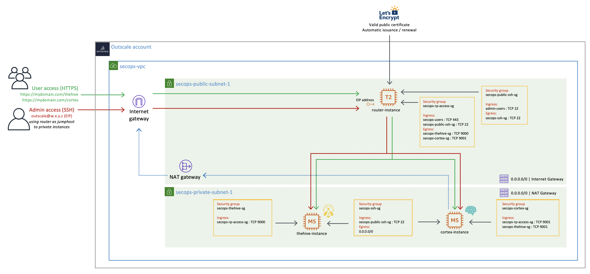
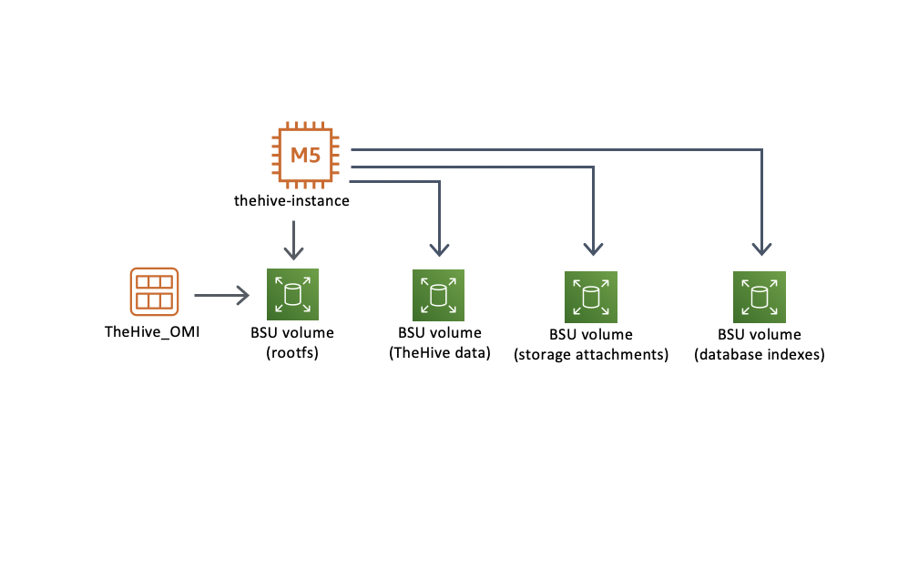
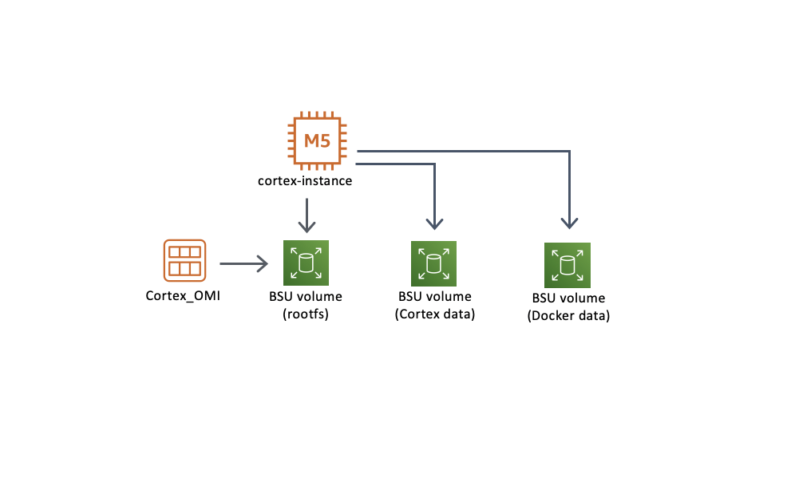
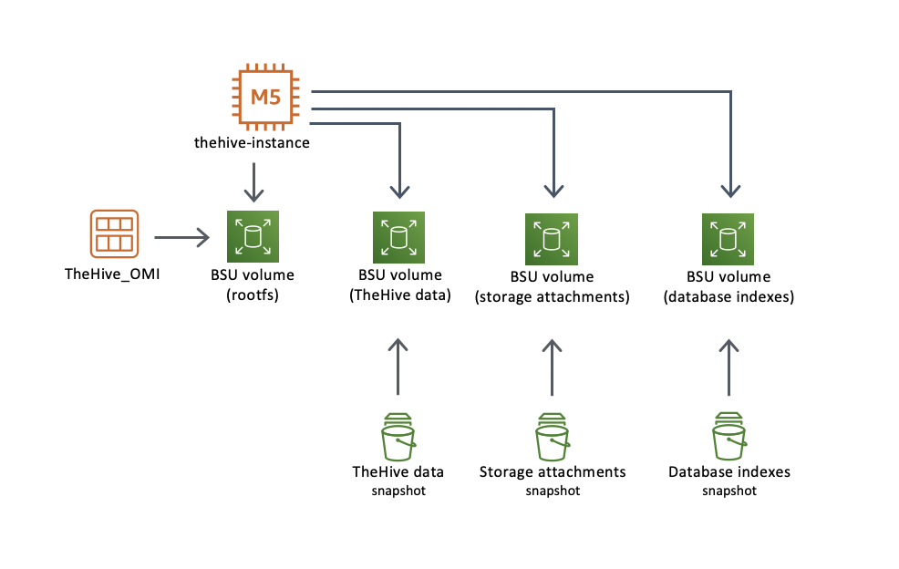
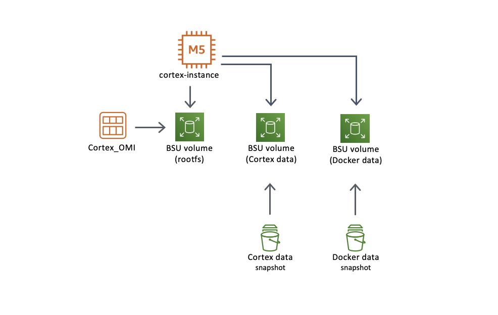

# Outscale sample code

## Overview 

The sample Terraform code in this repository allows the creation of a complete SecOps VPC to host your TheHive and Cortex instances and expose them using a simple reverse proxy.



The code defaults to this new VPC but can easily be adapted to fit your existing VPC by customising a few variables. Unless your architecture significantly differs from our reference VPC, you should not be required to modify the Terraform code itself.

## Creating a new SecOps VPC

If you do not already have a VPC at hand to deploy TheHive and Cortex into, using our sample code will allow you to build a "production-like" VPC very easily. 

Note that in a secured production environment, you might want to:

+ split the bastion host / reverse proxy functions on two distinct instances
+ alternatively, use a managed Load Balancer Unit instead of a self-hosted reverse proxy (logs are available using either option)
+ use an self-hosted internet proxy instead of the managed NAT Gateway (for which no logs are available, which is a huge security blindspot)

The VPC will include:

+ Two **public subnets** (only one is depicted)
+ Two **private subnets** (only one is depicted)
+ Five **security groups** 
+ An **internet gateway** (IG)
+ A **NAT gateway** in the first public subnet
+ **Route tables** for both public and private subnets
+ A **bastion / router host** that will serve the reverse proxy function (with automatic https with Let's Encrypt) and allow remote SSH access to private instances

### Security Groups
There are no default iptables rules implemented in the OMIs for either TheHive or Cortex (no OS-based IP filtering). Since we built the OMIs to be replaceable at each application update, somewhat like containers, we recommend limiting OS customisations to benefit from the easy update process. For that reason, filtering should be based on security groups only.

Keep in mind that the applications are listening on http, *not https*, be careful not to expose them on a public-facing network interface. 

The required security groups depicted above are created automatically along with the SecOps VPC.

### Bastion / router host
We launch a small instance to act as a bastion / router host. It is based on a hardened version of the official Ubuntu OMI from Outscale. The default sudoer user is *outscale*.

This instance includes a Caddy reverse proxy that is automatically configured to expose TheHive and Cortex on port 443/https with Let's Encrypt:

+ TheHive is available at https://router-fqdn/thehive
+ Cortex is available at https://router-fqdn/cortex

### SecOps VPC prerequisites

The router-fqdn must be a public DNS record in order for automatic https to work, using the public IP alone will fail. Make sure the FQDN you set in the variables already exists.

## TheHive and Cortex instances

This Terraform sample code can be used to initialize new TheHive and Cortex instances or to launch instances with existing data. **You must include** either the `instances-init-thehive-cortex.tf` or `instances-restore-thehive-cortex.tf` file from the `_use-cases` subfolder for the code to work.

### Information on default data volume configuration
All TheHive and Cortex data is stored on dedicated BSU volumes, not in the root BSU volume of each instance. This approach has many advantages:

+ Your root volume is disposable, you can replace your instance in seconds to update TheHive or Cortex by launching a fresh OMI.
+ Your data volumes can be of any size while keeping the root volume to its default size. 
+ Increasing the size of a data volume is a lot easier than changing the root volume size.
+ You can easily restore your databases to a previous state using volume snapshots. 

## Use-case 1: initial deployment of TheHive and Cortex.

To deploy new TheHive and Cortex instances with empty databases:

+ include or copy the `instances-init-thehive-cortex.tf` file from the `_use-cases` subfolder
+ update and review all variables in the `terraform.tfvars` file

By default, the sample code will create persistent BSU data volumes at launch that will not be deleted when the instances are terminated so that your data isn't accidentally lost.

### TheHive data volumes configuration


Detailed TheHive volume mappings:

**Root filesystem**

+ **Device name** (Outscale Cockpit / API): `/dev/sda1`
+ **Device name** (Ubuntu OS): `/dev/vda1`
+ **OS mount point**: `/`

**TheHive database volume**

+ **Device name** (Outscale Cockpit / API): `/dev/sdh`
+ **Device name** (Ubuntu OS): `/dev/xvdh` (which is an alias pointing to `/dev/sd_`)
+ **OS mount point**: `/var/lib/cassandra`

**TheHive storage attachments volume**

+ **Device name** (Outscale Cockpit / API): `/dev/sdi`
+ **Device name** (Ubuntu OS): `/dev/xvdi` (which is an alias pointing to `/dev/sd_`)
+ **OS mount point**: `/opt/thp_data/files/thehive`

**TheHive database indexes volume**

+ **Device name** (Outscale Cockpit / API): `/dev/sdj`
+ **Device name** (Ubuntu OS): `/dev/xvdj` (which is an alias pointing to `/dev/sd_`)
+ **OS mount point**: `/opt/thp_data/index`

### Cortex data volumes configuration


Detailed Cortex volume mappings:

**Root filesystem**

+ **Device name** (Outscale Cockpit / API): `/dev/sda1`
+ **Device name** (Ubuntu OS): `/dev/vda1`
+ **OS mount point**: `/`

**Cortex database volume**

+ **Device name** (Outscale Cockpit / API): `/dev/sdh`
+ **Device name** (Ubuntu OS): `/dev/xvdh` (which is an alias pointing to `/dev/sd_`)
+ **OS mount point**: `/var/lib/elasticsearch`

**Cortex Docker volume**

+ **Device name** (Outscale Cockpit / API): `/dev/sdi`
+ **Device name** (Ubuntu OS): `/dev/xvdi` (which is an alias pointing to `/dev/sd_`)
+ **OS mount point**: `/var/lib/docker`

## Use-case 2: Upgrading or restoring TheHive and Cortex instances.

To deploy TheHive and Cortex instances from a fresh OMI while restoring previous data:

+ include or copy the `instances-restore-thehive-cortex.tf` file from the `_use-cases` subfolder (remove any reference to `instances-init-thehive-cortex.tf`)
+ make sure snapshots are available for all TheHive and Cortex data volumes (the sample code locates those volumes based on their description but you can use other filters, such as the snapshot ids)
+ update and review all variables in the `terraform.tfvars` file

By default, the sample code will create new persistent BSU data volumes at launch that will not be deleted when the instances are terminated so that your data isn't accidentally lost (**those are NEW volumes** - the volumes from previous instances are not used / touched so you can roll back to them in case if you ever need to).

### TheHive data volumes when restoring from snapshots


### Cortex data volumes when restoring from snapshots


## Connecting to your TheHive and Cortex instances with SSH
Since our TheHive and Cortex instances are located in a private subnet, we cannot directly SSH into them using their private IP addresses. If you have set up a bastion host configuration similarly to our reference architecture, you can seamlessly connect to private instances using the *proxyjump* functionality of the ssh client. 

The easiest way to do that is to create (or update) the `~/.ssh/config` file. Use the example below as a reference and replace the ip addresses and private key information (you can use the same key on all instances or use a different key on each instance).

The default username for all instances (bastion, TheHive and Cortex) is `outscale`.

```
Host bastion
				HostName w.x.y.z (public ip address)
				User outscale
				Port 22
				IdentityFile ~/.ssh/id_rsa_private_key_for_bastion

Host thehive
				HostName w.x.y.z (private ip address)
				User outscale
				Port 22
				ProxyJump bastion
				IdentityFile ~/.ssh/id_rsa_private_key_for_thehive

Host cortex
				HostName w.x.y.z (private ip address)
				User outscale
				Port 22
				ProxyJump bastion
				IdentityFile ~/.ssh/id_rsa_private_key_for_cortex
```

You will now be able to SSH into the TheHive or Cortex instance directly using the bastion host as a proxy:

`ssh thehive`

or 

`ssh cortex`

**Note**: Remember to whitelist your local public IP address in the bastion security group.


---
Terraform compatibility: v1.0.x